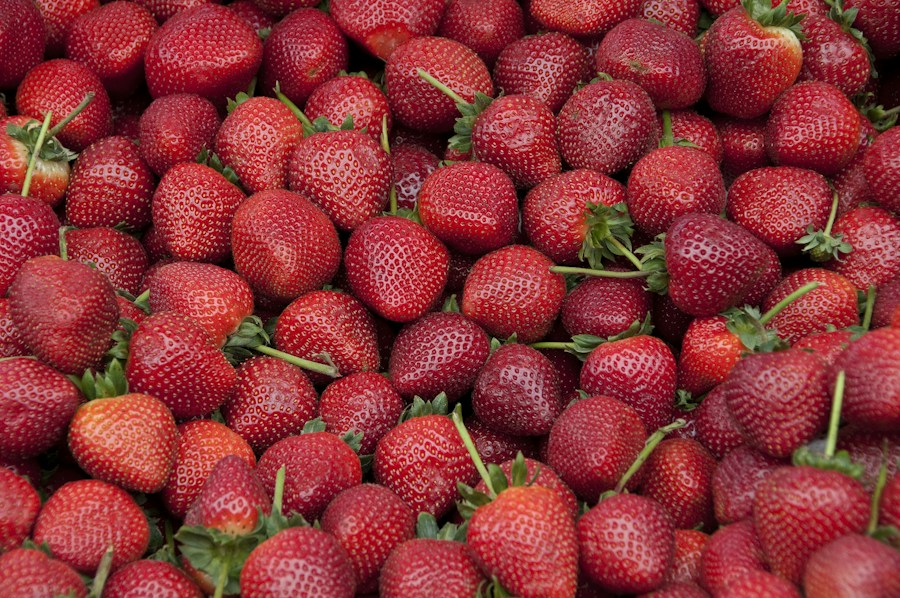
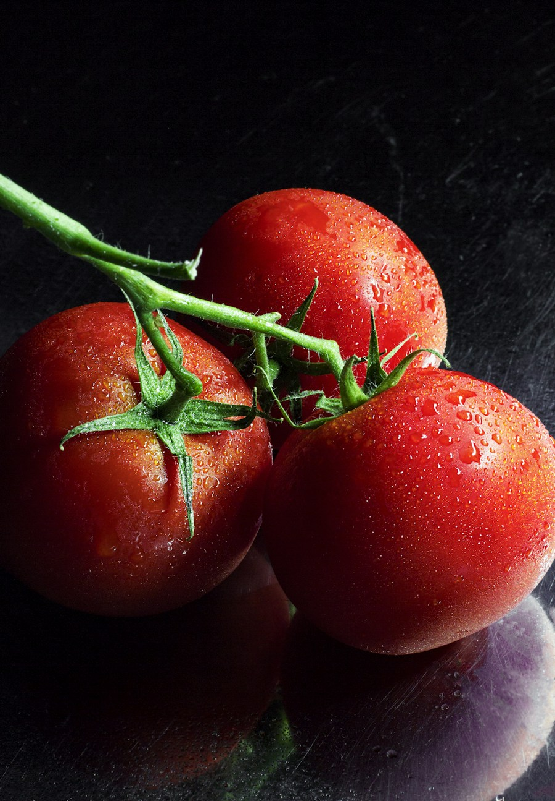
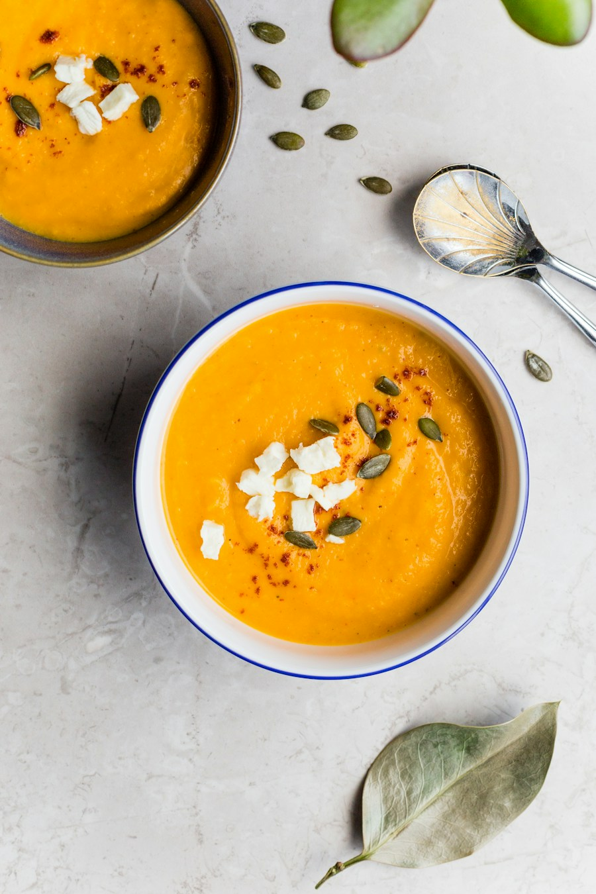

## 문제 1

Q: 다음 이미지에 대한 설명 중 옳지 않은 것은 무엇인가요?
- (1) 이미지에는 많은 딸기가 담겨 있습니다.
- (2) 딸기는 주로 빨간색을 띄고 있습니다.
- (3) 딸기의 색상은 초록색입니다.
- (4) 몇몇 딸기에는 잎이 붙어 있습니다.

Listening: Which of the following descriptions of the image is incorrect?
- (1) The image contains many strawberries.
- (2) The strawberries are mainly red.
- (3) The color of the strawberries is green.
- (4) Some of the strawberries have leaves attached.

정답: (3) 딸기의 색상은 초록색이 아닌 빨간색입니다.

-------------------

## 문제 2

Q: 다음 이미지에 대한 설명 중 옳지 않은 것은 무엇인가요?
- (1) 이미지에는 세 개의 토마토가 담겨 있습니다.
- (2) 토마토는 빨간색이며 물방울이 맺혀 있습니다.
- (3) 토마토는 나뭇가지에 매달려 있습니다.
- (4) 이미지에는 감자가 포함되어 있습니다.

Listening: Which of the following descriptions of the image is incorrect?
- (1) The image shows three tomatoes.
- (2) The tomatoes are red and have droplets on them.
- (3) The tomatoes are hanging from a branch.
- (4) The image includes potatoes.

정답: (4) 이미지에는 감자가 포함되어 있지 않고, 토마토만 있습니다.

-------------------

## 문제 3

Q: 다음 이미지에 대한 설명 중 옳지 않은 것은 무엇인가요?
- (1) 두 개의 그릇에 수프가 담겨 있습니다.
- (2) 수프 위에 흰색 치즈 조각이 있습니다.
- (3) 수프의 색상은 녹색입니다.
- (4) 그릇 주위에 호박씨가 있습니다.

Listening: Which of the following descriptions of the image is incorrect?
- (1) There are two bowls with soup in them.
- (2) There are pieces of white cheese on top of the soup.
- (3) The color of the soup is green.
- (4) There are pumpkin seeds around the bowls.

정답: (3) 수프의 색상은 녹색이 아닌 주황색입니다.

-------------------

